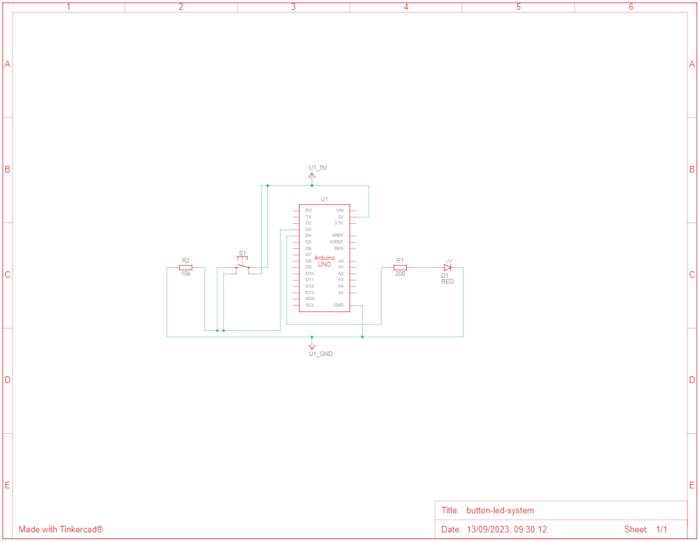

# Building a digital system to light up the push button LED 💡

The objective of this project was to design a system that turns on an LED while the button is pressed. The button output signal was used as input to the microcontroller to decide whether or not to light the LED. The focus was not only on the development of the project, but also on the application of the knowledge acquired on the Arduino platform, as well as on C programming, directly manipulating the registers of the microcontroller used (ATMega2560 in practice and ATMega328p in simulations in [Tinkercad](https :/ /www.tinkercad.com/)).

## 📦 Components List

|Name|Quantity|Component                                             |
|----|--------|------------------------------------------------------|
|U1  |1       |Arduino Uno (ATMega328p) or Arduino Mega (ATMega2560) |
|D1  |1       |Red LED                                               |
|S1  |1       |Pushbutton                                            |
|R1  |1       |200 Ω Resistor                                        |
|R2  |1       |10 kΩ Resistor                                        |


## 💡 Schematic View

|                                                    Schematic view of the project (Arduino Uno ATMega328p)                                                 |
|-----------------------------------------------------------------------------------------------------------------------------------------------------------|
| [](./assets/docs/button-led-system-schematic.pdf) |

## 💻 Simulation

[Button LED System Simulation](./assets/imgs/button-led-system-simulation.png)

### 📌 Program 1 - Direct Register Manipulation

This program demonstrates the use of direct register manipulation on an AVR microcontroller to control an LED based on the state of a button. It provides a simple example of how to configure and control input and output pins without relying on high-level libraries, offering greater control over the microcontroller's hardware.

**Description of the Code:**

  * Pin Definitions: Two variables, `buttonPin` and `ledPin`, are defined to represent the pin numbers of the button and the LED, respectively.
  * Main Function (main):
    * Pin Configuration: Direct register manipulation is used to configure the LED pin (PORTD4) as an output (DDR - Data Direction Register) and initialize it as LOW (off) (PORTD - Port Data Register).
    * Infinite Loop: The program enters an infinite loop (`while (1)`) to continuously monitor the state of the button.
    * Button Check: Direct register manipulation is used to check if the button pin (PIND3) is HIGH (pressed).
    * LED Control: If the button is pressed, the LED pin (PORTD4) is set to HIGH (on), turning on the LED. If the button is not pressed, the LED is turned off by setting the pin to LOW.

```c
unsigned int BUTTON_PIN = 3; // define pin for signal button
unsigned int LED_PIN = 4; // define pin for signal LED
unsigned int BUTTON_STATE = 0; // define state of button for control of system (1=on/0=off)

void setup() {
  pinMode(LED_PIN , OUTPUT); // signal LED is output
  pinMode(BUTTON_PIN , INPUT); // signal button is input
}

void loop() {
  BUTTON_STATE = digitalRead(BUTTON_PIN); // Read button state
  if (BUTTON_STATE == HIGH) {
    digitalWrite(LED_PIN , HIGH); // turn on the LED
  } else {
    digitalWrite(LED_PIN, LOW);	// turn of the LED
  }

  delay(100);
}
```

### 📌 Program 2 - Using Arduino Commands

This program showcases the use of Arduino's high-level functions for controlling a simple LED setup with a button. It offers a user-friendly approach to microcontroller programming, making it accessible for individuals who may not be familiar with low-level hardware manipulation. However, it's important to note that this code relies on Arduino's built-in libraries for pin control, which abstract away the low-level details of microcontroller hardware control.

**Description of the Code:**

  * Variable Definitions: The program starts by defining three unsigned integer variables - BUTTON_PIN, LED_PIN, and BUTTON_STATE. These variables are used to specify the pins for the button and LED, as well as to store the button's current state (1 for on, 0 for off).
  * Setup Function: In the setup() function, the code sets up the pinMode for the LED and button pins. The LED_PIN is configured as an OUTPUT, indicating that it will be used to control the LED, while the BUTTON_PIN is set as an INPUT to read the button's state.
  * Loop Function: The loop() function continuously executes the following steps:
    * BUTTON_STATE = digitalRead(BUTTON_PIN);: It reads the state of the button using digitalRead() and stores it in the BUTTON_STATE variable.
    * if (BUTTON_STATE == HIGH) {...} else {...}: It checks the value of BUTTON_STATE. If the button is pressed (HIGH), it turns on the LED by setting LED_PIN to HIGH using digitalWrite(). Otherwise, it turns off the LED by setting LED_PIN to LOW.
    * delay(100);: A delay of 100 milliseconds is added to avoid rapid toggling of the LED state.

```c
#include <util/delay.h>

int buttonPin = 3;      
int ledPin = 4;         

int main(void) {
     DDRD |= (1 << DDD4);     
    PORTD &= ~(1 << PORTD4); 

    while (1) {
        if (PIND & (1 << PIND3)) {
            PORTD |= (1 << PORTD4); 
        } else {
            PORTD &= ~(1 << PORTD4); 
        }
    }

    return 0;
}

```

### 📌 Equivalent Commands

..

### 📌 Runtime

..

### 📄 Report

[ ] - Access the report [here](./assets/docs/project_report.pdf).


### 🫂 Authors

- [Ernane Ferreira](https://github.com/ernanej)
- [Quelita Mirian](https://github.com/quelita2)
- [Thiago Lopes](https://github.com/thiagonasmto)

---

<div align="center">
  DCA0119 - Digital Systems (2023.1) <br/>
  Federal University of Rio Grande do Norte - Department of Computer and Automation Engineering (DCA).
</div>
