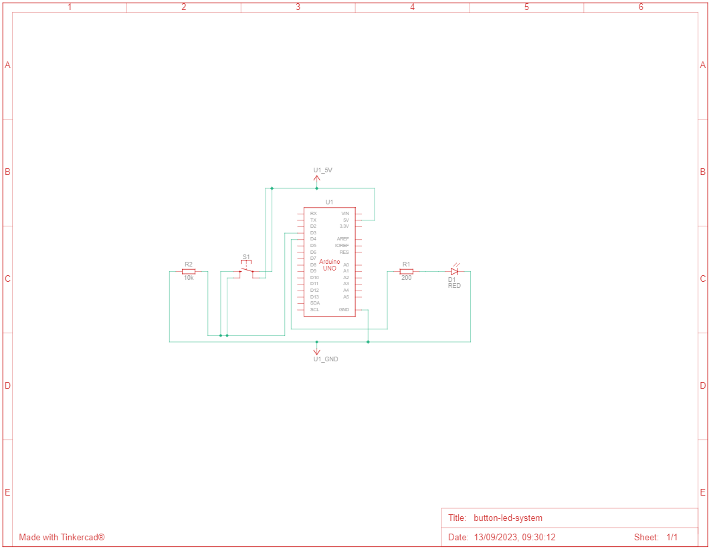
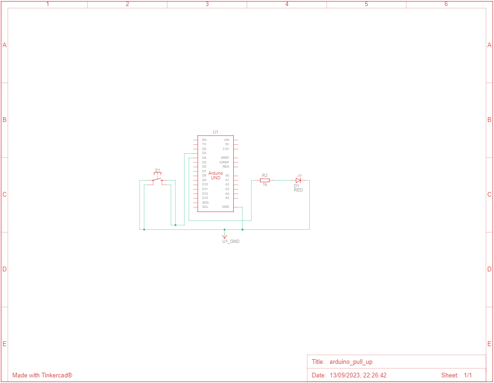

# Building a digital system to light up the push button LED 💡

The objective of this project was to design a system that turns on an LED while the button is pressed. The button output signal was used as input to the microcontroller to decide whether or not to light the LED. The focus was not only on the development of the project, but also on the application of the knowledge acquired on the Arduino platform, as well as on C programming, directly manipulating the registers of the microcontroller used (ATMega2560 in practice and ATMega328p in simulations in [Tinkercad](https://www.tinkercad.com/).

## 📦 Components List

|Name|Quantity|Component                                             |
|----|--------|------------------------------------------------------|
|U1  |1       |Arduino Uno (ATMega328p) or Arduino Mega (ATMega2560) |
|D1  |1       |Red LED                                               |
|S1  |1       |Pushbutton                                            |
|R1  |1       |200 Ω Resistor                                        |
|R2  |1       |10 kΩ Resistor                                        |


## 💡 Schematic View

| Schematic view of the project (Arduino Uno ATMega328p with external pull-up) | Schematic view of the project (Arduino Uno ATMega328p with native pull-up) |
|------------------------------------------------------------------------------|----------------------------------------------------------------------------|
| [](./assets/docs/button-led-system-schematic.pdf) | [](./assets/docs/button-led-system-schematic-pull-up.pdf) |

## 💻 Simulation
|Protoboard system (external pull-up)| Protoboard system (native pull-up) |
|----------------------------------|-----------------------------------|
||||

### 📌 Program 1 - Direct Register Manipulation

This program demonstrates the use of direct register manipulation on an AVR microcontroller to control an LED based on the state of a button. It provides a simple example of how to configure and control input and output pins without relying on high-level libraries, offering greater control over the microcontroller's hardware.

Instructions for implementing logic with registers:

| Constant  | Description                                      |
|------------|------------------------------------------------|
| PORTD      | Output Control Register for Port D      |
| DDRD       | Data Direction Register for Port D|
| PIND       | Input State Register for Port D      |
| PD0 to PD7  | Digital I/O Pins of Port D                  |
| PORTB      | Output Control Register for Port B      |
| DDRB       | Data Direction Register for Port B|
| PINB       | Input State Register for Port B      |
| PB0 to PB7  | Digital I/O Pins of Port B                  |
| PORTC      | Output Control Register for Port C      |
| DDRC       | Data Direction Register for Port C|
| PINC       | Input State Register for Port C      |
| PC0 to PC7  | Digital I/O Pins of Port C                  |
| HIGH       | Represents logic level high (1)              |
| LOW        | Represents logic level low (0)             |
| INPUT      | Sets the pin as input                      |
| OUTPUT     | Sets the pin as output                        |
| INPUT_PULLUP | Sets the pin as input with an active pull-up resistor |

**Description of the Code:**

  * Pin Definitions: Two variables, `buttonPin` and `ledPin`, are defined to represent the pin numbers of the button and the LED, respectively.
  * Main Function (main):
    * Pin Configuration: Direct register manipulation is used to configure the LED pin (PORTD4) as an output (DDR - Data Direction Register) and initialize it as LOW (off) (PORTD - Port Data Register).
    * Infinite Loop: The program enters an infinite loop (`while (1)`) to continuously monitor the state of the button.
    * Button Check: Direct register manipulation is used to check if the button pin (PIND3) is HIGH (pressed).
    * LED Control: If the button is pressed, the LED pin (PORTD4) is set to HIGH (on), turning on the LED. If the button is not pressed, the LED is turned off by setting the pin to LOW.

```c
unsigned int BUTTON_PIN = 3; // define pin for signal button
unsigned int LED_PIN = 4; // define pin for signal LED
unsigned int BUTTON_STATE = 0; // define state of button for control of system (1=on/0=off)

void setup() {
  pinMode(LED_PIN , OUTPUT); // signal LED is output
  pinMode(BUTTON_PIN , INPUT); // signal button is input
}

void loop() {
  BUTTON_STATE = digitalRead(BUTTON_PIN); // Read button state
  if (BUTTON_STATE == HIGH) {
    digitalWrite(LED_PIN , HIGH); // turn on the LED
  } else {
    digitalWrite(LED_PIN, LOW);	// turn of the LED
  }

  delay(100);
}
```

**Equivalent code using register access:**
```c
int main(void) {
    DDRD |= (1 << DDD4);     // Configure ledPin (pin 4) as an output
    PORTD &= ~(1 << PORTD4); // Turn off the LED initially

    while (1) {
        if (PIND & (1 << PIND3)) {
            PORTD |= (1 << PORTD4); // Turn on the LED
        } else {
            PORTD &= ~(1 << PORTD4); // Turn off the LED
        }
    }

    return 0;
}
```

### 📌 Program 2 - Using Arduino Commands

This program demonstrates the use of Arduino's high-level functions to control a simple setup with an LED and a button. When the pushbutton is pressed, the LED is turned on, and when it is released, the LED is turned off.

**Description of the Code:**

* Variable Declarations: The program starts by declaring two constant integer variables, buttonPin and ledPin, to specify the pin numbers for the pushbutton and the LED, respectively. Additionally, there is an integer variable buttonState to store the current state of the pushbutton.
* Setup Function: In the setup() function, the code performs the following actions:
 * Configures the ledPin as an OUTPUT, indicating that it will control the LED.
 * Configures the buttonPin as an INPUT with an internal pull-up resistor. The pull-up resistor ensures that the button's pin is pulled HIGH when the button is not pressed.
* Loop Function: The loop() function is the main program loop, and it continuously executes the following steps:
 * Reads the state of the pushbutton using digitalRead(buttonPin) and stores it in the buttonState variable.
 * Checks if the pushbutton is pressed. If the buttonState is LOW, it indicates that the button is pressed.
 * If the button is pressed (LOW), the code sets the ledPin to HIGH using digitalWrite(ledPin, HIGH), turning on the LED.
 * If the button is not pressed (HIGH), the code sets the ledPin to LOW using digitalWrite(ledPin, LOW), turning off the LED.

```c
const int buttonPin = 3;  // the number of the pushbutton pin
const int ledPin = 4;    // the number of the LED pin

// variables will change:
int portState = 0;  // variable for reading the pushbutton status

void setup() {
  // initialize the LED pin as an output:
  pinMode(ledPin, OUTPUT);
  // initialize the pushbutton pin as an input:
  pinMode(buttonPin, INPUT_PULLUP);
}

void loop() {
  // read the state of the pushbutton value:
  portState = digitalRead(buttonPin);

  // check if the pushbutton is pressed. If it is, the buttonState is HIGH:
  if (portState == LOW) {
    // turn LED on:
    digitalWrite(ledPin, HIGH);
  } else {
    // turn LED off:
    digitalWrite(ledPin, LOW);
  }
}
```
**Equivalent code using register access:**
```c
int main(void) {
    DDRD = 0x10;   // Configura ledPin (pino 4) como saída
    PORTD = 0x08;  // Configura o pino 3 como Pull-up 
  
    while (1) {
        if (PIND & 0x08) { // PIND - Registrador de leitura do estado do Port D
            PORTD = 0x08;  // Desliga o LED
        } else {
            PORTD = 0x18;  // Liga o LED
        }
    }
    return 0;
}
```

### 📌 Equivalent Commands

..

### 📄 Report

[ ] - Access the report [here](./assets/docs/project_report.pdf).


### 🫂 Authors

- [Ernane Ferreira](https://github.com/ernanej)
- [Quelita Mirian](https://github.com/quelita2)
- [Thiago Lopes](https://github.com/thiagonasmto)

---

<div align="center">
  DCA0119 - Digital Systems (2023.1) <br/>
  Federal University of Rio Grande do Norte - Department of Computer and Automation Engineering (DCA).
</div>
